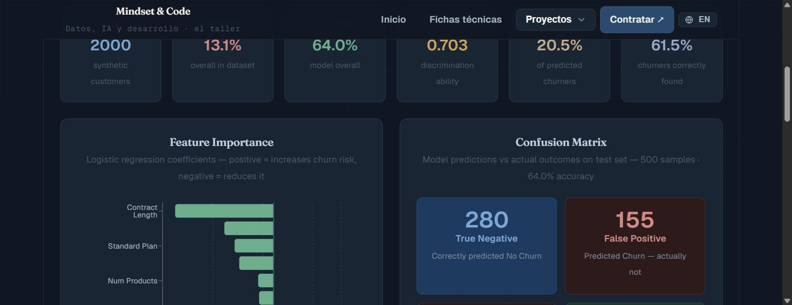

# Predictive Churn Analysis — Customer Retention ML

> **Data Science portfolio project** · Python · scikit-learn · Logistic Regression
> **Status:** Finished · Live on portfolio
> An end-to-end churn-prediction pipeline — from synthetic data to a trained, evaluated model and an interactive dashboard — that identifies which customers are about to leave and *why*.

> 🇬🇧 **English version first.** · 🇪🇸 **La versión en español está más abajo** → [ir a Español](#-español).

[](https://proyectos-mindset-code.web.app/churn)
[](https://mindset-code.com/es/codigo)
[](.)
[](.)
[](LICENSE)

[](https://proyectos-mindset-code.web.app/churn)

*[Open the live demo](https://proyectos-mindset-code.web.app/churn)*

---

## The problem this solves

Acquiring a customer costs far more than keeping one — so the most valuable question a subscription business can answer is *"who is about to churn, and what's driving it?"* This project builds the machine-learning pipeline that answers it: it predicts churn probability per customer and surfaces the **business drivers** behind the prediction, giving retention teams actionable lead time instead of a post-mortem.

It demonstrates the full data-science workflow — data generation, preprocessing, handling class imbalance, model training, rigorous evaluation, and communicating results — connecting Data Science directly to Revenue Operations.

**▶ Live dashboard: [proyectos-mindset-code.web.app/churn](https://proyectos-mindset-code.web.app/churn)**

---

## Model performance

| Metric | Value |
|--------|-------|
| **AUC-ROC** | 0.703 |
| **Accuracy** | 64.0% |
| **Recall (churn)** | 0.615 |
| **Precision (churn)** | 0.205 |

Every figure here comes out of `python churn_analysis.py` on the committed dataset, and the script writes them into `analysis_results.md` and `data/*.json` so they cannot drift from the code.

**AUC-ROC is the headline** because the classes are imbalanced: 13.1% of customers churn, so a model that predicted "nobody leaves" would score 86.9% accuracy while being useless. Read the two class metrics together:

- **Recall 0.615** — it catches 3 of every 5 customers who do leave.
- **Precision 0.205** — but 4 of every 5 it flags were not going to leave.

That trade is deliberate: `class_weight='balanced'` moves the threshold towards catching leavers, because a retention call to someone who was staying costs far less than losing a customer nobody called. Whether it is the *right* trade depends on what that call costs, and this repository does not model that.

---

## How it works

1. **Data** — `generate_data.py` builds a synthetic, labelled customer dataset.
2. **Preprocessing** — one-hot encoding of `SubscriptionType`, feature selection, `StandardScaler` normalization.
3. **Class imbalance** — `class_weight='balanced'` + a stratified train/test split so the minority (churned) class isn't drowned out.
4. **Model** — `LogisticRegression` (`max_iter=1000`, `random_state=42`) — chosen for interpretability: coefficients map directly to business drivers.
5. **Evaluation** — accuracy, precision/recall, ROC-AUC and a confusion matrix (`confusion_matrix.png`).

**Features:** Age · MonthlyCharges · TotalUsageHours · SupportTickets · ContractDuration · TenureMonths · NumProducts · SubscriptionType.

---

## Key findings

- **Short contract duration** is the strongest churn predictor — month-to-month customers churn well above annual subscribers.
- **High support-ticket volume** signals unresolved friction and imminent churn.
- **Low product engagement** (usage hours) precedes churn — the earliest warning sign.

---

## Tech stack

| Layer | Technology |
|-------|-----------|
| Language | Python 3.12 |
| ML | scikit-learn (LogisticRegression, StandardScaler) |
| Data | Pandas · NumPy |
| Visualization | Matplotlib · Seaborn · React (dashboard) |

---

## Getting started

```bash
git clone https://github.com/mindset-code/project-churn-analysis.git
cd project-churn-analysis
python -m venv .venv && source .venv/bin/activate
pip install -r requirements.txt

python generate_data.py     # build the synthetic dataset
python churn_analysis.py    # train, evaluate, export metrics + confusion_matrix.png
```

---

## Repository structure

```
project-churn-analysis/
├── churn_analysis.py     # full pipeline: preprocessing → model → metrics
├── generate_data.py      # synthetic dataset generator
├── confusion_matrix.png  # model evaluation output
├── requirements.txt      # Python dependencies
├── LICENSE               # MIT
└── README.md
```

---

## License & contact

Released under the **[MIT License](LICENSE)**.

- **Portfolio:** [proyectos-mindset-code.web.app](https://proyectos-mindset-code.web.app)
- **Web:** [mindset-code.com](https://mindset-code.com/es)
- **Email:** contacto@mindset-code.com

---

# 🇪🇸 Español

# Predictive Churn Analysis — ML de retención de clientes

> **Proyecto de portafolio de Data Science** · Python · scikit-learn · Regresión Logística
> **Estado:** Terminado · Publicado en el portafolio
> Pipeline de predicción de churn de extremo a extremo —de los datos sintéticos a un modelo entrenado y evaluado y un dashboard interactivo— que identifica qué clientes están a punto de irse y *por qué*.

> 🇪🇸 Traducción al español. La versión en inglés está al inicio → [ir a English](#predictive-churn-analysis--customer-retention-ml).

---

## El problema que resuelve

Captar un cliente cuesta mucho más que retenerlo — así que la pregunta más valiosa para un negocio de suscripción es *"¿quién está a punto de irse y qué lo provoca?"*. Este proyecto construye el pipeline de machine learning que la responde: predice la probabilidad de churn por cliente y expone los **drivers de negocio** detrás de la predicción, dando a los equipos de retención tiempo para actuar en lugar de una autopsia.

Demuestra el flujo completo de data science —generación de datos, preprocesamiento, manejo de clases desbalanceadas, entrenamiento, evaluación rigurosa y comunicación de resultados— conectando Data Science directamente con Revenue Operations.

**▶ Dashboard en vivo: [proyectos-mindset-code.web.app/churn](https://proyectos-mindset-code.web.app/churn)**

---

## Rendimiento del modelo

| Métrica | Valor |
|---------|-------|
| **AUC-ROC** | 0,703 |
| **Accuracy** | 64,0 % |
| **Recall (churn)** | 0,615 |
| **Precisión (churn)** | 0,205 |

Todas estas cifras salen de ejecutar `python churn_analysis.py` sobre el dataset commiteado, y el script las escribe en `analysis_results.md` y en `data/*.json` para que no puedan separarse del código.

**El AUC-ROC es la métrica principal** porque las clases están desbalanceadas: se va el 13,1 % de los clientes, así que un modelo que predijera «no se va nadie» sacaría un 86,9 % de accuracy siendo inútil. Las dos métricas de clase se leen juntas:

- **Recall 0,615** — caza a 3 de cada 5 clientes que efectivamente se van.
- **Precisión 0,205** — pero 4 de cada 5 a los que señala no se iban a ir.

Ese intercambio es deliberado: `class_weight='balanced'` mueve el umbral hacia cazar a los que se van, porque una llamada de retención a alguien que se quedaba cuesta mucho menos que perder a un cliente al que nadie llamó. Si es el intercambio *correcto* depende de lo que cueste esa llamada, y este repositorio no modela eso.

---

## Cómo funciona

1. **Datos** — `generate_data.py` genera un dataset sintético etiquetado de clientes.
2. **Preprocesamiento** — one-hot encoding de `SubscriptionType`, selección de features, normalización con `StandardScaler`.
3. **Desbalanceo** — `class_weight='balanced'` + split estratificado para que la clase minoritaria (churned) no se diluya.
4. **Modelo** — `LogisticRegression` (`max_iter=1000`, `random_state=42`) — elegido por interpretabilidad: los coeficientes mapean directamente a drivers de negocio.
5. **Evaluación** — accuracy, precisión/recall, ROC-AUC y matriz de confusión (`confusion_matrix.png`).

**Features:** Age · MonthlyCharges · TotalUsageHours · SupportTickets · ContractDuration · TenureMonths · NumProducts · SubscriptionType.

---

## Hallazgos clave

- **La duración corta de contrato** es el predictor más fuerte — los clientes mes a mes churnan muy por encima de los anuales.
- **El alto volumen de tickets de soporte** señala fricción no resuelta y churn inminente.
- **El bajo engagement** (horas de uso) precede al churn — la señal de alerta más temprana.

---

## Stack técnico

| Capa | Tecnología |
|------|-----------|
| Lenguaje | Python 3.12 |
| ML | scikit-learn (LogisticRegression, StandardScaler) |
| Datos | Pandas · NumPy |
| Visualización | Matplotlib · Seaborn · React (dashboard) |

---

## Cómo empezar

```bash
git clone https://github.com/mindset-code/project-churn-analysis.git
cd project-churn-analysis
python -m venv .venv && source .venv/bin/activate
pip install -r requirements.txt

python generate_data.py     # genera el dataset sintético
python churn_analysis.py    # entrena, evalúa y exporta métricas + confusion_matrix.png
```

---

## Estructura del repositorio

```
project-churn-analysis/
├── churn_analysis.py     # pipeline completo: preprocesamiento → modelo → métricas
├── generate_data.py      # generador de dataset sintético
├── confusion_matrix.png  # salida de evaluación del modelo
├── requirements.txt      # dependencias Python
├── LICENSE               # MIT
└── README.md
```

---

## Licencia y contacto

Publicado bajo la **[Licencia MIT](LICENSE)**.

- **Portafolio:** [proyectos-mindset-code.web.app](https://proyectos-mindset-code.web.app)
- **Web:** [mindset-code.com](https://mindset-code.com/es)
- **Email:** contacto@mindset-code.com

---

*Mindset & Code · asesoría fiscal y tecnológica · [mindset-code.com](https://mindset-code.com/es)*
